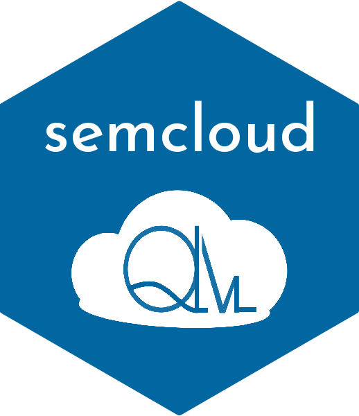

<!-- README.md is generated from README.Rmd. Please edit that file -->

```{r, include = FALSE}
knitr::opts_chunk$set(
  collapse = TRUE,
  comment = "#>",
  fig.path = "man/figures/README-",
  out.width = "100%"
)
```

# semcloud 

<!-- badges: start -->
[](https://zenodo.org/badge/latestdoi/400257454)
<!-- badges: end -->

The goal of semcloud is to process the output of the Python Workflow of
the Nephological Semantics project
(combining [nephosem](https://qlvl.github.io/nephosem)
and [semasioFlow](https://montesmariana.github.io/semasioFlow))
and prepare it to be
used with [NephoVis](https://qlvl.github.io/NephoVis).

## Installation

You can install the github development version with:

``` r
remotes::install_github("montesmariana/semcloud")
```

## Example

Instructions on how to go through the workflow can be found in a handful of
vignettes, available in the Articles section or by calling `vignette()`:

- `vignette('processClouds')` explains the steps from the output of
semasioFlow to the input of NephoVis;
- `vignette('weightConcordance')` shows how to create tailored contexts for Nephovis;
- `vignette('HDBSCAN')` shows how to implement HDBSCAN clustering on the models
and use the output to classify clouds (clusters).

To build vignettes when installing from GitHub run:

```r
remotes::install_github("montesmariana/semcloud", build_vignettes = T)
```


## License

This program is free software: you can redistribute it and/or modify it under the terms of the GNU General Public License as published by the Free Software Foundation, either version 3 of the License, or (at your option) any later version.

This program is distributed in the hope that it will be useful,
but WITHOUT ANY WARRANTY; without even the implied warranty of
MERCHANTABILITY or FITNESS FOR A PARTICULAR PURPOSE.  See the
GNU General Public License for more details.

You should have received a copy of the GNU General Public License along with this program.  If not, see <http://www.gnu.org/licenses/>.

